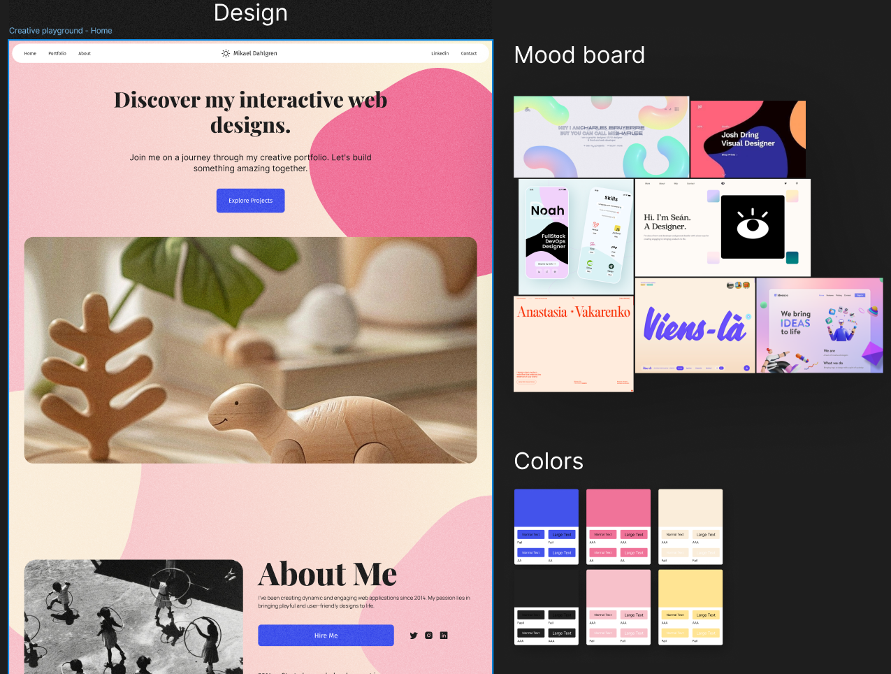
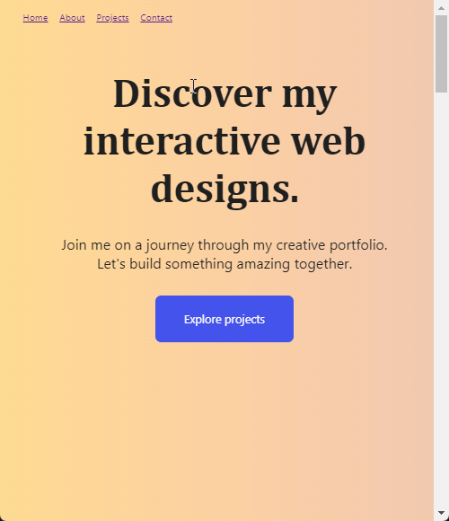

# Portfolio devlog

## Introduction

This project started with a clear objective: to minimize my reliance on JavaScript. I had the perfect project for it—my portfolio. Over the years, I've started countless portfolio projects using the latest frameworks, but I never finished them. The reasons varied from feature creep to losing interest in the framework.

HTMX has been rising in popularity lately, promising _no JavaScript_ and none of the complexity often associated with frontend frameworks. This was perfect, and I planned to leverage HTMX from the start. However, as soon as I started mocking up designs, curiosity struck: how far could I go using just HTML and CSS? Could I create a functional, aesthetically pleasing, and interactive web application with just HTML and CSS alone?

This challenge set the stage for a fascinating journey, pushing the boundaries of what HTML and CSS can achieve before integrating HTMX. It was also a great opportunity to learn about the performance of HTML and CSS, as JavaScript would not be the largest overhead.

In this devlog, I’ll share my experiences and insights as I navigated through HTML and CSS, eventually integrating HTMX to enhance my web application. My goal: to create a modern-looking, fully featured, performant portfolio using as little JavaScript as possible. *Rules: CSS and HTML hacks are only allowed as long as they don't significantly hurt accessibility or performance.*

## Day 1 - Design

I prefer not to begin a project without having a clear design to follow. However, I also don't want to get too absorbed in the design process and lose focus on the project's main goal. So, I've turned to a method I've used before when time is limited: drawing significant inspiration from existing sources.
My goal was to make the page to feel visually impressive whilst still be readable, and let the design communicate a social and easy going personality.
Here is the process:
1. Identify "feel". (In this case I chose "playful" and "elegant" )
2. Go out and find some stuff that's out there based on those keywords and save them in a mood board
3. Extract some rough color scheme based on your mood board (try https://coolors.co/image-picker to extract a color scheme automatically from an image). 
4. Feed the color scheme to some AI model that generates generic web page design (example: [Muchi AI](https://musho.ai/))
5. Make some tweaks where the AI messed things up (mine came out filled in a screaming hot pink at first)

Here is the result from half a days work:

## Day 2 - Coding
I started by creating a HTML with some place holder text. Just some headers and lorem ipsum paragraphs. 
At first I had an idea about setting display:none to each section, then in the header menu use link to set #[id] of those sections, and the [:target](https://developer.mozilla.org/en-US/docs/Web/CSS/:target) pseudo-selector to set display:block. That way I could mimic the behaviour of a SPA and treat each section as a "page". However, I descided against it since it seemed a bit too "hacky" and I first want to see if I can make a single page with all the content, and if I run to trouble with that I'll reconsider this solution.
For the time being I let header navigation scroll the user to the relevant section. It's as easy as 
`<a href="home" ...>`
and then...
`<section id="home"...>`

For the smooth scrolling, just set "scroll-behaviour: smooth-scroll" on the html tag

Feeling inspired from the day before, I decided to implement a film-grain effect and some animated blobs I'd seen while gathering ideas. To avoid using JavaScript, I made the film grain a background image on a pseudo-element, jittering it with an animated transform. I used a 128x128 Gaussian noise image, compressed to 3kb, but I believe I can reduce it to under 1kb by cropping and rotating copies. The blobs are simple SVG elements with transforms. To create a dynamic background, I used animation-timeline: scroll() to blend between two gradients. 

Here is the result:
